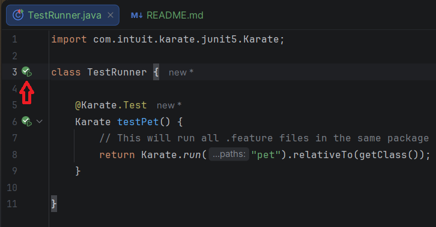

# Demo of Api Testing with Karate Framework

### Prerequisites
Here we will describe the versions of dependencies, packages, or other technologies that need to be configured on the local machine.
* **Java JDK 11** or higher
* **IntelliJ IDEA**
* **Maven** 

### Folder Structure
```
karate-project/
 └── src/
     └── test
         ├── create-pet-helper.feature 
         ├── karate-config.js
         ├── pet.feature
         ├── pet.json
         └── TestRunner.java
```
`pet.json`: File containing json payload to create a pet.

`create-pet-helper.feature`: It is a reusable mini-script that creates a pet and saves the ID. The @ignore tag means it never runs by itself.

`pet.feature`:This is the actual test suite. It uses Gherkin (Given, When, Then) to tell a story.

`TestRunner.java`: The file acts as the bridge between the Java environment (Maven/IntelliJ) and the Karate .feature files.

### Steps
1. Clone the repository.
2. Open IntelliJ IDEA and select the project.
3. Wait until IntelliJ download all Maven dependencies.
4. Then navigate to `src/test/java`.
5. Open the `TestRunner.java` file. 
6. Click the green **Play** button next to the class or method name.

    

### Reporting
After executing the test, the report will be generated in the following path:`target/karate-reports/karate-summary.html`.

### Video
See the configuration setup tutorial [here](https://drive.google.com/file/d/1nX7LUtjOnwfrKO0nFhsB8ZwqtlvMI1-m/view?usp=sharing).